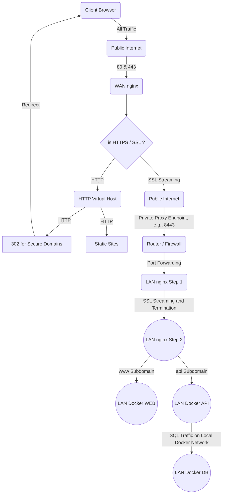

#  Friendly Stats
A website that lets friends track stats with one another. (Poker games, silly bets, gin rummy score, etc...)

## Table of Contents
- [Links](#links)
- [Requirements](#requirements)
- [Tools](#tools)
- [Server](#server)
- [Client](#client)
- [DevOps](#dev-ops)
- [Goal](#goals)

## Links
- [Github](https://github.com/sonicbigboom/friendly-stats)
- [Hosted](https://www.potrt.com/friendly-stats)

## Requirements
- Docker - [Instruction](https://docs.docker.com/engine/install/) \
	Necessary for the database and for runnning production. Also easier to run.

### API Local Requirements
- Java 21 - [Download](https://github.com/adoptium/temurin21-binaries/releases/download/jdk-21.0.4+7/OpenJDK21U-jdk_x64_windows_hotspot_21.0.4_7.msi) \
	Necessary for development of the api with gradle. Allows for running the api locally and running spotlessApply.

### Website Local Requirements
- NPM 10.8.1 - [Instructions](https://nodejs.org/en/download/package-manager)
	Necessary for developing the React frontend locally. Allows for local deployment and building production.

## Tools
- DBeaver - [Download](https://dbeaver.io/download/) \
  Useful for connecting to the database directly. Locally, the database should be a Microsoft SQL Server database at `localhost:1433`.  The database name is `stats`.

- Postman - [Download](https://www.postman.com/downloads/) \
  Useful for testing API endpoints.

## Server
### Setup
Copy `.env.example` to `.env` and edit variables as needed:

`COMPOSE_PROFILES` - Which environment this is for. Enumeration: `dev`, `dev-partial`, `prod` \
`COMPOSE_PROJECT_NAME` - The docker container group name. For example: `friendly_stats` \
`FRIENDLY_STATS_SIGNATURE` - An HMAC-SHA256 hex hash that is the application's secret signature. \
`FRIENDLY_STATS_DB_USERNAME` - The database username. For example: `sa` \
`FRIENDLY_STATS_DB_PASSWORD` - The database host. \
`FRIENDLY_STATS_GOOGLE_API_CLIENT_ID` - The google oauth client id for the server. \
`FRIENDLY_STATS_GOOGLE_APP_CLIENT_ID` - The google oauth client id for clients. This should be the same as `REACT_APP_FRIENDLY_STATS_GOOGLE_CLIENT_ID`. \
`FRIENDLY_STATS_GOOGLE_CLIENT_SECRET` - The google oauth client secret. \
`FRIENDLY_STATS_EMAIL_ADDRESS` - The application email address. For example: `friendly-stats-noreply@potrt.com` \
`FRIENDLY_STATS_EMAIL_HOST` - The application email's host. For example: `smtp.gmail.com` \
`FRIENDLY_STATS_EMAIL_PORT` - The applicaiton email's ssl port. For example: `465` \
`FRIENDLY_STATS_EMAIL_USERNAME` - The application email's username. \
`FRIENDLY_STATS_EMAIL_PASSWORD` - The application email's password.

If running the api locally and not in a container, all of these variables must be set in the system's environment variables. Additionally, add the following variable:

`FRIENDLY_STATS_DB_HOST` - The database host. For example: `localhost:1433`\

### Run
Run: `docker-compose up -d` \
Stop: `docker-compose down`

Stop and remove the image: Run compose down and add a `--rmi local` flag.

> [!WARNING]  
> The followng deletes data! \
> Stop and remove volumes: Run compose down and add a `-v` flag.

#### Local Run
Run: `gradlew bootRun`

## Client
### Setup
Copy `.env.example` to `.env` and edit variables as needed:

`REACT_APP_FRIENDLY_STATS_WEB_HOST` - The base client application url. For example: `localhost:3000` \
`REACT_APP_FRIENDLY_STATS_API_HOST` - The base server application url. For example: `https://api.potrt.com/friendly-stats` or `http://localhost:8080` \
`REACT_APP_FRIENDLY_STATS_GOOGLE_CLIENT_ID` - The google oauth client id for clients.

### Run

#### Local Run
Run: `npm start`

## DevOps

To ensure SSL connection, prevent direct access to my private network, and properly route domains, this project uses a complex traffic routing system.

### SSL Certificate

This project uses Letsencrypt, a free certificate authority.
To use Letsencrypt with the multiple subdomains in this project, a wildcard SSL certificate is used for the domain to streamline the process.

### Reverse Proxy

Two proxy servers are used:
- WAN proxy
- LAN proxy

Nginx is used here for a variety of considerations
- Cost
	- Public-facing hosts/VMs/containers requires minimum resources
	- CPU and memory intensive work run on private VMs/containers
- Security
	- Hide web/api/db servers in private network
	- Minimize servers atack surface

### Network Topology

### Important Points

- SSL proxy is insufficient and inappropriate because WAN traffic traverses the public internet.
- SSL streaming is required to encrypt traffic across the internet.
- By default, Nginx (from APT package and older Docker images) is not compiled with SSL Streaming option.
  - Recent Docker images come with SSL Streaming option compiled.
  - Exec into the container and run `nginx -V` to check options for `stream_ssl_module` and `stream_ssl_preread_module`.
- SSL Termination takes place at LAN Proxy
	- Hence, wildcard SSL certificate is not needed on WAN Proxy; only needed by LAN Proxy.
- Virtual Host is not possible with SSL Stream since it cannot peak into the header.
- Virtual Host is instead handled on the LAN side.

## Goals
- Users information is tied to an account (oauth2?)
- Users can create a group that tracks game data
- This group can track any number of games desired
	- One of these games is poker
		- This should track money over time
		- This should also handle buy in and cash outs
	- Another 'game' is bets
	- It should be easy for users to make their own games / stat counters
- Set up auto-renewal (every 90 days) for Letsencrypt